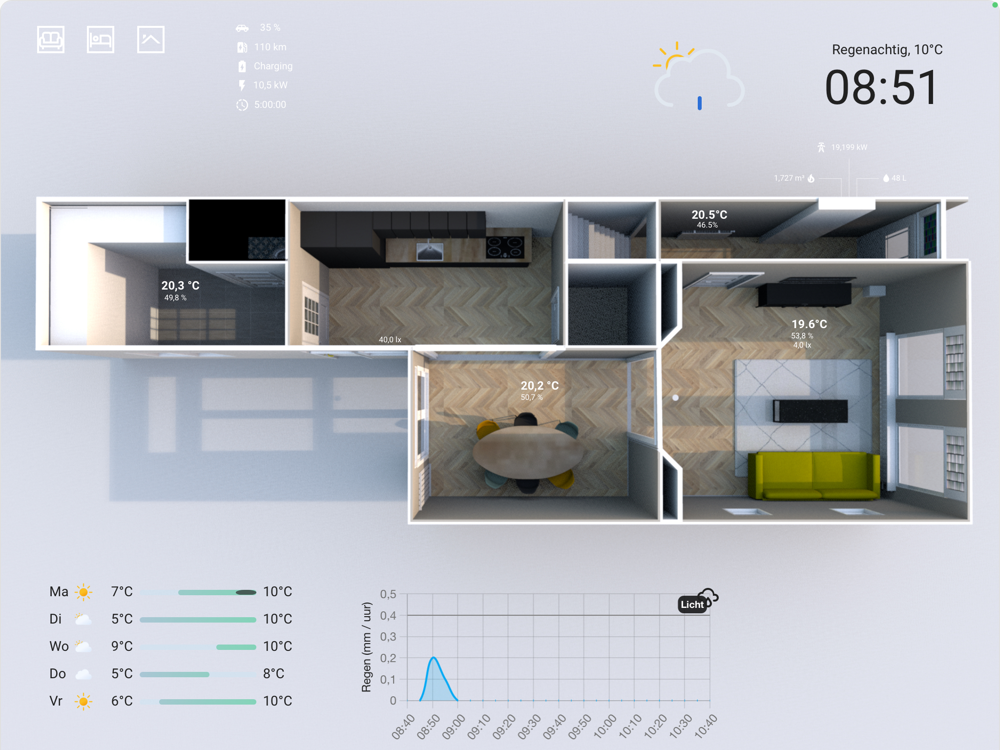

# Floorplan
This folder contains all materials to build up the 3D floorplan with the [picture elements](https://www.home-assistant.io/dashboards/picture-elements/) card as the foundation. Details about how the floorplan is built up in Home Assistant can be found in the [wiki](https://github.com/EBOOZ/HomeAssistant/wiki/3.-Floorplan).

## Tools
I've used the following tools to draw my house in 3D and to create overlays when lights are turned on:
* SweetHome3D: https://sweethome3d.com
* Paint.net: https://www.getpaint.net

## Sources
I used the following sources for guidance and inspiration:
* Salvamipc's tutorial for SweetHome3D: https://youtu.be/3Umo0vkLxRY
* Tweakers.net 'Show your setup'-topic (Dutch): https://gathering.tweakers.net/forum/list_message/76466906#76466906

## Frontend integrations
These integrations are installed specifically to get to the desired end-state of the floorplan:
| Integration | Description | Repository |
| --- | --- | --- |
| wallpanel | To display the floorplan fullscreen, without the top and side bars | [link](https://github.com/j-a-n/lovelace-wallpanel) |
| browser_mod | Used to be able to pop-up cards (i.e. blinds, climate, and media) | [link]( https://github.com/thomasloven/hass-browser_mod) |
| card-mod | Enables advanced CSS modification for ha-cards | [link]( https://github.com/thomasloven/lovelace-card-mod) |
| button-card | For displaying animated icons and advanced CSS | [link]( https://github.com/custom-cards/button-card) |
| clock-weather-card | Displays weather information in the top-right and bottom left| [link]( https://github.com/pkissling/clock-weather-card) |
| neerslag-card | Shows the predicted rain fall for the next two hours | [link]( https://github.com/aex351/home-assistant-neerslag-card) |

## Results
| Ground floor | First floor | Roof |
| --- | --- | --- |
|  |  |  |
|  |  |  |
