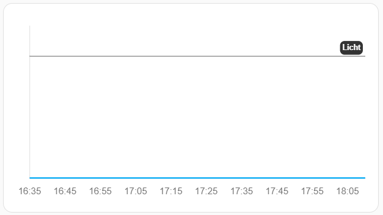

# Neerslag Card
[Neerslag Card](https://github.com/aex351/home-assistant-neerslag-card) is a nice way to display the rain forecast on your dashboard. While it's not messy, there's room for improvement and make it more clean. 

I'm lucky that I can use Github Copilot in VS Code, so it could assist me while analyzing the `neerslag-card.js` file to figure out what I needed to change to remove the gray boxes, removing the icon, change the stepsize on the x-axis, and to remove the y-axis values.

In the `neerslag-card.js` file the graph can be adjusted from line `442`. This is what the code should look like:
```javascript
scales: {
    y: {
        ticks:{display:false,color: secondaryTextColor,maxRotation:0,minRotation:0},
        beginAtZero: true,
        title: {
            display: false,
            text: this.localize('regenMmUur'),
            color: primaryTextColor,
        },
        suggestedMax: this.zoomwaarde,
        suggestedMin: 0.0,
        beginAtZero: true,
    },
    x: {
        ticks:{color: secondaryTextColor,maxRotation:0,minRotation:0},
        title: {
            display: false,
            text: this.localize('regenvalVoorspelling'),
            color: primaryTextColor,
        },
        min: 5,
        stepSize: 1,
    }
},
```
The result will be as follows:


You can use the code in this repository to replace the original JavaScript-module in Home Assistant!